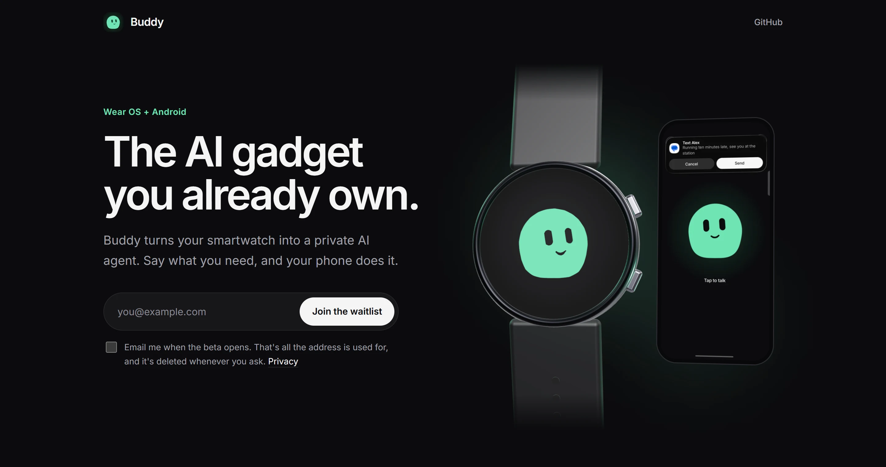

# Buddy site

[](https://heybuddy-watch.vercel.app)
[](LICENSE)
[](https://nextjs.org)



The landing page and beta waitlist for **Buddy**, the private, hands-free AI agent on the smartwatch you
already wear. The app itself (the watch, the phone and everything between them) is in
[thenguyentrong/watch-ai](https://github.com/thenguyentrong/watch-ai).

Live at [heybuddy-watch.vercel.app](https://heybuddy-watch.vercel.app).

---

## Guide

1. **📖 See it**
   - Open [heybuddy-watch.vercel.app](https://heybuddy-watch.vercel.app), or read [how it works](#how-it-works).

2. **🔧 Run it**
   - `npm install`, then `npm run dev`.
   - For the waitlist, pull the database URL and create the table once:
     ```
     vercel env pull .env.local
     node --env-file=.env.local scripts/migrate.mjs
     ```
     Without a database the page runs the same; joining the list just shows an error.

3. **💻 Change it**
   - The whole page is [app/page.tsx](app/page.tsx). Find your way with the
     [repository structure](#repository-structure).
   - The entrances are plain CSS, see [Motion](#motion).

4. **🚀 Ship it**
   - `vercel deploy --prod`, then check it reached Ready: `vercel inspect heybuddy-watch.vercel.app`.

---

## How it works

### The page

It tells Buddy's story in the order of the demo video: the hook (*the AI gadget you already own*), the
video itself, the problem, a conversation that plays out, what Buddy does on the phone, privacy, the safety rules, what
you need (a watch, earbuds, your ChatGPT plan), Buddy Plus, and the waitlist again at the end.

### Motion

The entrances are timed like the demo video. A headline rises word by word, then the things next to it
pop in, one after another: a request is typed out, then its pop-up drops in.

- Each element says which move it makes (`data-a="rise"`, `"word"`, `"drop"`, ...) and when (`--d`).
  The moves are keyframes in [app/globals.css](app/globals.css); `Words`, `Typed` and `at()` in
  [app/_components/motion.tsx](app/_components/motion.tsx) write the delays.
- A block (`data-seq`) waits until it's on screen. A small script in the page's `<head>`
  ([app/_components/sequence.ts](app/_components/sequence.ts)) starts it, and blocks that show up
  together go one after another. The hero plays as soon as the page shows.
- With reduced motion everything is simply there. Without JavaScript the entrances play once on load.

> [!NOTE]
> The script never changes the DOM that React renders. It pauses the blocks with a constructed
> stylesheet and starts them with the Web Animations API, so hydration stays clean.

### The watch

The hero watch is three.js ([app/_components/watch-3d.tsx](app/_components/watch-3d.tsx)): a metal
case, a bezel, glass, two buttons and a strap, turning slowly and tilting towards the pointer. Buddy's
face on it comes from the app's own animation engine ([public/buddy-frames.json](public/buddy-frames.json)):
resting, listening while you type your email, happy once you've joined. Until the first 3D frame, a
drawn CSS watch stands in.

### The waitlist

A server action ([app/actions.ts](app/actions.ts)) stores the email address, the time and the consent
sentence in Neon Postgres in Frankfurt. That's all: no cookies, no analytics. A hidden field catches
bots. What's stored and why is on the [privacy page](https://heybuddy-watch.vercel.app/privacy).

The demo video ([app/_components/demo-video.tsx](app/_components/demo-video.tsx)) is a picture from this site
until you press play. Only then does it load from YouTube, in its privacy-enhanced mode.

---

## Repository structure

```
app/
  page.tsx               the landing page
  layout.tsx             fonts, metadata and the entrance script in <head>
  globals.css            colours, the drawn watch and every entrance
  actions.ts             joining the waitlist
  privacy/, imprint/     the legal pages
  _components/
    watch-3d.tsx         the three.js watch in the hero
    hero-watch.tsx       the drawn watch first, the 3D one once it's ready
    watch.tsx            the drawn CSS watch
    buddy-face.tsx       Buddy's face, from the app's frames
    waitlist-form.tsx    the form; Buddy listens while you type
    demo-video.tsx       the demo video, loaded from YouTube only after you press play
    motion.tsx           Words, Typed and the delays
    sequence.ts          starts each block when it scrolls into view
public/
  buddy-frames.json      Buddy's animation, exported from the app
  img/                   screenshots from the app
scripts/migrate.mjs      creates the waitlist table
docs/media/              pictures for this README
```

---

## License

[Apache-2.0](LICENSE), like the app.
